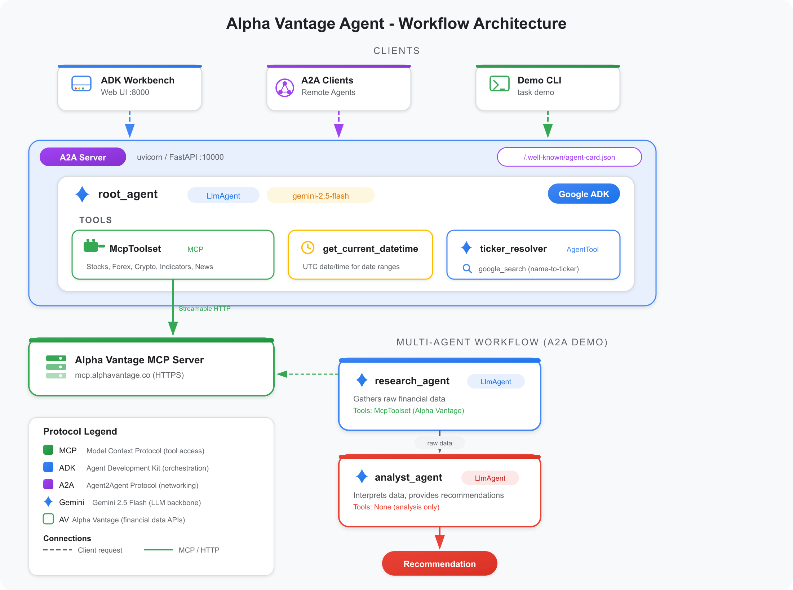

# Building a Financial AI Agent with Google ADK, MCP, and A2A

*A deep dive into composing three open protocols to create an agentic system that queries real-time financial data, resolves company names to tickers, and delivers investment recommendations.*

---

The agentic AI ecosystem is converging on a small set of open protocols that, when composed together, let you build remarkably capable systems from relatively little code. This post walks through a project that wires up three of them -- Google's **Agent Development Kit (ADK)**, the **Model Context Protocol (MCP)**, and the **Agent2Agent (A2A)** protocol -- to create a financial data agent backed by Alpha Vantage.

Rather than treat each protocol in isolation, we will look at how they layer on top of each other, where the seams are, and what patterns emerge when you build with all three at once.

## The Three Protocols

Before diving into code, a brief primer on each protocol and why it exists.

### Model Context Protocol (MCP)

MCP standardises the interface between an LLM-based application and external tools. Instead of hand-writing API wrappers and JSON schemas for every data source, you point your agent at an MCP server and it discovers the available tools at startup. The server advertises tool names, descriptions, parameter schemas, and return types. The client (your agent framework) consumes them.

Alpha Vantage publishes an MCP server at `mcp.alphavantage.co` that exposes over 60 financial data tools -- stock quotes, company overviews, earnings, forex rates, crypto prices, technical indicators, news sentiment, and macroeconomic data. A single HTTP endpoint replaces dozens of bespoke API integrations.

### Agent Development Kit (ADK)

Google's ADK is an open-source Python framework for building agents powered by Gemini (or other models). An ADK `LlmAgent` combines a model, a system instruction, and a set of tools. The framework handles the orchestration loop: the model decides which tool to call, ADK executes it, feeds the result back to the model, and repeats until the model produces a final response.

ADK supports sub-agents via `AgentTool`, which wraps one agent as a callable tool for another. This lets you compose agent hierarchies where a root agent delegates to specialised sub-agents.

### Agent2Agent (A2A) Protocol

A2A is a protocol for agents to discover and communicate with each other over HTTP. An A2A server publishes an agent card at `/.well-known/agent-card.json` describing its capabilities, and accepts requests at its root endpoint. This means an agent built in ADK can be consumed by a client built on LangChain, CrewAI, or any other framework that speaks A2A.

ADK ships with a `to_a2a()` utility that wraps any agent as a FastAPI application with these endpoints, requiring just one line of code.

## Architecture

The system composes these three protocols vertically:

<p align="center">
  
</p>

At the bottom, MCP provides access to financial data. In the middle, ADK orchestrates agent logic, tool invocation, and sub-agent delegation. At the top, A2A exposes the entire system as a network service.

Three client entry points exist: the ADK Workbench (a web UI on port 8000), any A2A-compatible remote agent or client, and a CLI demo harness.

## Agent Hierarchy

### The Root Agent

The root agent is an `LlmAgent` configured with Gemini 2.5 Flash, a detailed system instruction, and three tools.

```python
from google.adk.agents import LlmAgent
from google.adk.tools.mcp_tool import McpToolset, StreamableHTTPConnectionParams

MCP_URL = f"https://mcp.alphavantage.co/mcp?apikey={api_key}"

toolset = McpToolset(
    connection_params=StreamableHTTPConnectionParams(url=MCP_URL)
)

root_agent = LlmAgent(
    model=os.getenv("AGENT_GEMINI_MODEL", "gemini-2.5-flash"),
    name="alpha_vantage_agent",
    description="An agent that provides financial data and stock analysis "
                "using Alpha Vantage.",
    instruction=SYSTEM_INSTRUCTION,
    tools=[toolset, get_current_datetime, ticker_resolver_tool],
)
```

The `McpToolset` is the key integration point. At startup it connects to the Alpha Vantage MCP server, discovers all available tools, and registers them with the agent. No manual tool definitions are needed -- if Alpha Vantage adds a new endpoint to their MCP server tomorrow, the agent picks it up automatically on its next startup.

The system instruction is deliberately detailed. It enumerates tool categories (core stock APIs, fundamental data, alpha intelligence, forex and crypto, economic indicators, technical indicators), provides usage guidelines for each, and documents the Alpha Vantage rate limit of one request per three seconds. This level of specificity helps the model make better tool-selection decisions and avoid hitting rate limits.

### The Ticker Resolver Sub-Agent

A common usability issue with financial APIs is that they require ticker symbols, but users think in company names. The ticker resolver sub-agent solves this by using Google Search to resolve names to symbols.

```python
from google.adk.agents import LlmAgent
from google.adk.tools import google_search

ticker_resolver_agent = LlmAgent(
    model=os.getenv("AGENT_GEMINI_MODEL", "gemini-2.5-flash"),
    name="ticker_resolver",
    description="Resolves a company name to its stock ticker symbol "
                "using Google Search.",
    instruction=(
        "You are a stock ticker symbol resolver. "
        "When given a company name, use google_search to find its official "
        "stock ticker symbol. "
        "Search for '<company name> stock ticker symbol "
        "site:finance.yahoo.com OR site:google.com/finance'. "
        "Return only the ticker symbol as plain text."
    ),
    tools=[google_search],
)
```

The root agent wraps this sub-agent as an `AgentTool`, so it appears as just another callable tool in the root agent's toolset. When a user says "What is the price of NVIDIA?", the root agent recognises "NVIDIA" as a company name, delegates to the ticker resolver, receives "NVDA" back, and then proceeds to call the appropriate MCP tool with that symbol.

This pattern -- sub-agents as tools -- is one of the more useful compositional features of ADK. Each sub-agent has its own system instruction, its own tools, and its own model call. The root agent does not need to know how ticker resolution works; it just needs to know when to use it.

## Data Flow

### Single-Agent Query

Here is what happens when a user asks "What is the price of NVIDIA?":

```
1. User sends query
2. root_agent identifies "NVIDIA" as a company name
3. root_agent invokes ticker_resolver_tool
4. ticker_resolver_agent uses google_search, returns "NVDA"
5. root_agent invokes MCP tool GLOBAL_QUOTE(symbol="NVDA")
6. Alpha Vantage MCP server returns price data
7. root_agent generates natural language response
```

Steps 3-4 and 5-6 each involve a full model-tool-model loop. The root agent makes two separate delegation decisions: first to resolve the ticker, then to fetch the quote. ADK handles the plumbing.

### Multi-Agent Workflow

The project also includes a multi-agent demo that separates data gathering from analysis using two specialised agents.

```python
research_agent = LlmAgent(
    name="research_agent",
    description="Gathers financial data and news using Alpha Vantage tools.",
    instruction=(
        "You are a Financial Research Agent. Your sole job is to gather data. "
        "Use 'global_quote', 'company_overview', 'earnings', and "
        "'news_sentiment' to collect facts. "
        "Provide raw, structured data to the Analyst Agent. "
        "Do not interpret the data yourself."
    ),
    tools=[McpToolset(...)],
)

analyst_agent = LlmAgent(
    name="analyst_agent",
    description="Analyzes financial data gathered by the research agent.",
    instruction=(
        "You are a Senior Financial Analyst. Your job is to interpret data "
        "provided by the Research Agent. "
        "Analyze trends, earnings performance, and news sentiment to provide "
        "a buy/sell/hold recommendation."
    ),
)
```

The research agent has MCP tools; the analyst agent has none. They execute sequentially: the research agent gathers raw data, then its output is passed as context to the analyst agent, which produces an investment recommendation.

```
User Query ("Analyze AAPL")
    |
    v
research_agent --> Alpha Vantage MCP --> Raw Data
    |
    v
analyst_agent --> Investment Recommendation
```

This separation has practical benefits. The research agent's token budget goes toward tool calls and data ingestion. The analyst agent's token budget goes entirely toward reasoning. Neither agent needs to do both, which improves the quality of each step.

## Exposing the Agent as an A2A Service

Converting the root agent into a network service takes one function call.

```python
from google.adk.a2a.utils.agent_to_a2a import to_a2a

port = int(os.getenv("AGENT_PORT", 10000))
a2a_app = to_a2a(root_agent, port=port)
```

This produces a FastAPI application with two endpoints:

- `GET /.well-known/agent-card.json` -- returns a JSON document describing the agent's name, description, and capabilities. Other agents or clients use this for discovery.
- `POST /` -- accepts A2A `SendMessageRequest` payloads and returns the agent's response.

The server runs on uvicorn and handles graceful shutdown by closing the MCP toolset connection.

```python
async def serve():
    config = uvicorn.Config(a2a_app, host="localhost", port=port)
    server = uvicorn.Server(config)
    logger.info("agent_server_started", port=port)
    try:
        await server.serve()
    finally:
        await toolset.close()
        logger.info("agent_server_stopped")
```

Any A2A-compatible client can now query this agent over HTTP, regardless of what framework it was built with.

## Resilience

Alpha Vantage's free tier allows one request per three seconds. The project addresses this at multiple levels.

### System Instruction

The root agent's system instruction explicitly states the rate limit. This is a soft control -- the model is aware of the constraint and tends to avoid issuing rapid consecutive tool calls.

### Retry with Exponential Backoff

A `tenacity`-based retry decorator handles transient failures, including rate-limit rejections.

```python
from tenacity import (
    retry,
    stop_after_attempt,
    wait_exponential_jitter,
)

agent_retry = retry(
    stop=stop_after_attempt(3),
    wait=wait_exponential_jitter(initial=3, max=60),
    reraise=True,
)
```

The strategy is: wait 3 seconds plus jitter on the first failure, double the wait on the second, and give up after three attempts. Failed attempts are logged at error level so they surface in monitoring.

### Demo Script Delays

The demo scripts introduce a three-second sleep between queries as a coarse-grained rate limiter. This is deliberately simple -- the demo is meant to show the agent working, not to be a production rate-limiting solution.

## Observability

The project uses structlog with two rendering modes, selectable via the `LOG_JSON` environment variable.

In development (the default), you get human-readable, colored console output:

```
2026-03-17 14:30:00 [info] agent_server_started  port=10000
2026-03-17 14:30:05 [info] agent_task_started    query="price of NVDA"
2026-03-17 14:30:08 [info] agent_task_completed  duration=3.2s
```

In production (`LOG_JSON=TRUE`), you get machine-parseable JSON suitable for log aggregation:

```json
{"event": "agent_server_started", "port": 10000, "timestamp": "2026-03-17T14:30:00Z"}
```

Logged events cover the full lifecycle: server start/stop, task start/complete/fail, retry attempts, and demo workflow phases.

## Running It

### Prerequisites

- Python 3.13+
- [uv](https://docs.astral.sh/uv/) for dependency management
- [Taskfile](https://taskfile.dev/) for task automation
- An [Alpha Vantage API key](https://www.alphavantage.co/support/#api-key)
- A Google AI Studio API key or Vertex AI configuration

### Setup

```bash
# Clone the repository
git clone https://github.com/nhsy/google-adk-alpha-vantage.git
cd google-adk-alpha-vantage

# Copy environment template and fill in your API keys
cp .env.example .env

# Initialize the project (installs dependencies)
task init
```

### Start the Agent

```bash
# Start as an A2A service (port 10000)
task up:agent

# Or start the ADK Workbench (port 8000)
task up:adk
```

### Run Demos

```bash
# Single-agent demo: 4 financial queries
task demo:agent

# Multi-agent demo: research + analyst workflow
task demo:a2a
```

### Run Tests

```bash
# Unit tests
task test

# Unit tests with coverage
task test:cov

# A2A integration tests (requires running server)
task test:a2a
```

## What Emerges from the Composition

Building with all three protocols simultaneously surfaces a few patterns that are not obvious when using them individually.

**MCP makes agents tool-rich without code overhead.** The root agent has access to 60+ financial data tools and the only code involved is a two-line `McpToolset` instantiation. Adding a new data source is a matter of pointing at a different MCP server.

**Sub-agents as tools create clean abstraction boundaries.** The ticker resolver is a full agent with its own model, instruction, and tools, but to the root agent it is just another callable tool. This keeps the root agent's system instruction focused on financial queries rather than search heuristics.

**A2A decouples the agent from its clients.** The same agent serves the ADK Workbench, the CLI demo, and any A2A-compatible remote client. The `to_a2a()` function is effectively an adapter pattern that lifts an ADK agent into the network layer with zero changes to the agent itself.

**Separation of concerns in multi-agent workflows pays off in token efficiency.** The research agent spends its context window on data ingestion; the analyst agent spends its on reasoning. Neither is diluted by the other's task.

The full source code is available on GitHub: [nhsy/google-adk-alpha-vantage](https://github.com/nhsy/google-adk-alpha-vantage).
